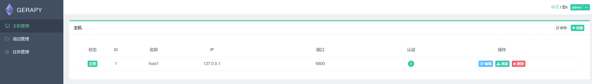

# 根目录各目录作用
### 根目录各目录作用

### gerapy各目录与文件作用

### 后端核心代码目录

## MVC模式
- 这是使用Django框架开发的，只需要看后端核心代码目录
- Gerapy使用了MVC模式，MVC 模式代表 Model-View-Controller（模型-视图-控制器） 模式：
**Model（模型）**：模型代表一个存取数据的对象。它也可以带有逻辑，在数据变化时更新控制器。
**View（视图）**：视图代表模型包含的数据的可视化。
**Controller（控制器）**：控制器作用于模型和视图上。它控制数据流向模型对象，并在数据变化时更新视图，它使视图与模型分离开。

- 由于它符合`Restful API`与`MVC`开发规范，所以我们迭代时后端代码只需要关注三个目录：

#### 模型层
- `models.py`定义了各个数据库字段、索引等信息

#### 控制层
- `ulrs.py`定义了各个API的业务执行入口与映射规则，每个API必须再次定义才能生效

#### 视图层
- `views.py`定义了接口的请求方式与权限，以及接口相关业务实现。

- 后续迭代无非就是对前端界面功能的增删改，那么每次操作对后端的影响都是通过接口来关联的
- 只要根据前端所调用的接口在`ulrs.py`找到在`views.py`对应的实现方法，就能按照新业务实现代码了

---
---
# vue架构解析
- 对于vue代码的迭代我们只需要关注`views`和`router.js`

### views
- 大家可以看到，views下各目录对应各栏目，每个目录下又区分了多个功能，后续迭代时只需要根据栏目找到对应的目录下的文件进行代码修改即可，以`主机管理`栏目为例：

**index.vue**：主页面

**create.vue**：新增主机界面

**edit.vue**：编辑界面

**schedule.vue**：调度界面

### router.js
- 该文件主要是配置路由跳转映射规则的，当我们更换映射文件或者映射路径时，都需要在此文件下更新配置

### 参数配置化
- 后续迭代时会经常更新的三个文件：`langs/zh.js`、`langs/en.js`、`store.js`，原作者基本把所有文本与API的定义都解耦到这三个文件了，后续使用开发工具直接跳转到引用处即可
