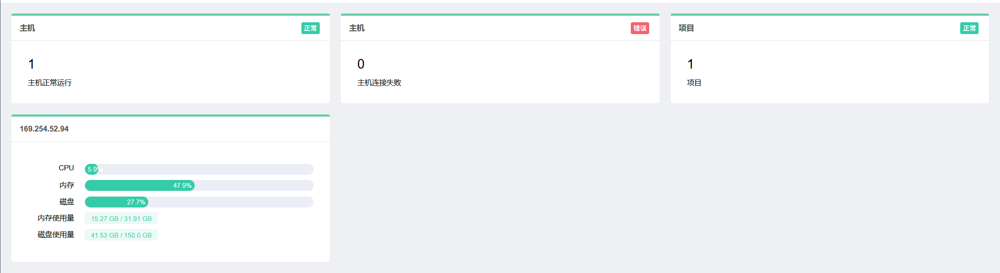
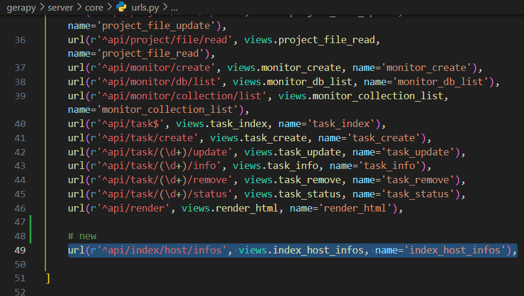
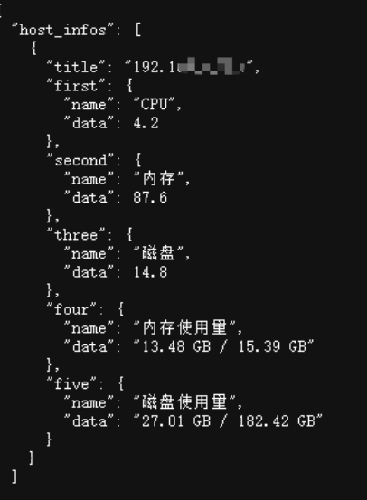
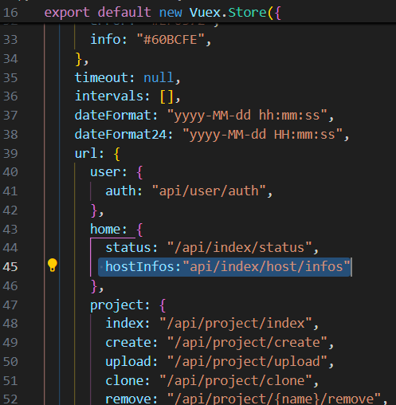
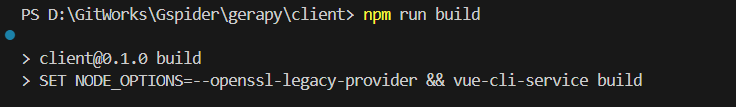
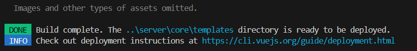

## 开发流程记录：
### 后端：
- 1 视图层`views.py`下新增一个获取主机资源的方法
- 2 控制层`urls.py`下新增一个API映射到这个方法

### 前端
- 因为修改的是首页主页，所以修改的是`views/home/index.vue`文件，然后可能还要对`langs/zh.js`、`langs/en.js`、`store.js`三个文件新增配置参数，接着请求后端提供的API接口根据返回的数据涉及页面样式。

---
---
### 后端代码迭代
#### gerapy\server\core\views.py
- 在文件下增加该方法，这里用`psutil`来提取主机资源数据，这是个第三方库，没安装的话需要安装一下

```
@log_exception()
@api_view(['GET'])
@permission_classes([IsAuthenticated])
def index_host_infos(request):
    """
    index host infos
    :param request: request object
    :return: json
    """
    if request.method == 'GET':

        def get_host_info():
            memory = psutil.virtual_memory()
            disk = psutil.disk_usage('/')
            data = {
                'title': None,
                'first': {'name': 'CPU', 'data': psutil.cpu_percent(interval=1)},
                'second': {'name': '内存', 'data': memory.percent},
                'three': {'name': '磁盘', 'data': disk.percent},
                'four': {'name': '内存使用量', 'data': '{} GB / {} GB'.format(
                    round(memory.used / 1024 / 1024 / 1024, 2), round(memory.total / 1024 / 1024 / 1024, 2))},
                'five': {'name': '磁盘使用量', 'data': '{} GB / {} GB'.format(
                    round(disk.used / 1024 / 1024 / 1024, 2), round(disk.total / 1024 / 1024 / 1024, 2))},
            }
            ip_adds = psutil.net_if_addrs()
            for key in ip_adds.keys():
                if '以太网' in key:
                    data['title'] = ip_adds[key][1].address
                    break
            return data

        data = [get_host_info()]
        return JsonResponse({'host_infos': data})
```
#### gerapy\server\core\urls.py
- 然后在该文件下新增一条API接口映射规则，指向上面创建的方法
```
url(r'^api/index/host/infos', views.index_host_infos, name='index_host_infos'),
```


#### 结果展示
- 如果想请求测试看看接口的效果，需要把`gerapy\server\core\views.py`方法的`@permission_classes([IsAuthenticated])`注释掉，这样就能直接请求了
- 接口：`http://127.0.0.1:8000/api/index/host/infos`


### 前端代码迭代
#### gerapy\client\src\views\home\Index.vue
- 在页面创建`（created、mounted）`时调用`getHostInfosData`方法将得到的数据赋值给`host_infos`，页面会根据`host_infos`进行渲染，同时调用`setupTimer`设置定时任务，定时调用接口实现主机资源情况实时更新。
- `gerapy\client\src\views\home\Index.vue`完整代码
```
<template>
	<div>
		<el-row :gutter="20">
			<el-col :span="8">
				<div class="panel">
					<panel-title :title="$lang.objects.client">
						<el-button size="mini" type="primary">
							{{ $lang.buttons.normal }}
						</el-button>
					</panel-title>
					<div v-loading="loading" class="panel-body">
						<h1 class="number">{{ status.success }}</h1>
						<small> {{ $lang.descriptions.normalClients }}</small>
					</div>
				</div>
			</el-col>
			<el-col :span="8">
				<div class="panel">
					<panel-title :title="$lang.objects.client">
						<el-button size="mini" type="danger">
							{{ $lang.buttons.error }}
						</el-button>
					</panel-title>
					<div v-loading="loading" class="panel-body">
						<h1 class="number">{{ status.error }}</h1>
						<small> {{ $lang.descriptions.errorClients }}</small>
					</div>
				</div>
			</el-col>
			<el-col :span="8">
				<div id="tree" class="panel">
					<panel-title :title="$lang.objects.project">
						<el-button size="mini" type="success">
							{{ $lang.buttons.normal }}
						</el-button>
					</panel-title>
					<div v-loading="loading" class="panel-body">
						<h1 class="number">{{ status.project }}</h1>
						<small>{{ $lang.descriptions.countProjects }}</small>
					</div>
				</div>
			</el-col>
		</el-row>
		<el-row :gutter="20" v-if="host_infos">
			<el-col :span="8" v-for="host_info in host_infos" :key="host_info.title">
				<div id="tree" class="panel">
					<panel-title :title="host_info.title"></panel-title>
					<div v-loading="loading" class="panel-body">
						<div class="grid_body">
							<small>{{ host_info.first.name }}</small>
							<el-progress :percentage="host_info.first.data" text-inside :stroke-width="20"></el-progress>
						</div>
						<div class="grid_body">
							<small>{{ host_info.second.name }}</small>
							<el-progress :percentage="host_info.second.data" text-inside :stroke-width="20"></el-progress>
						</div>
						<div class="grid_body">
							<small>{{ host_info.three.name }}</small>
							<el-progress :percentage="host_info.three.data" text-inside :stroke-width="20"></el-progress>
						</div>
						<div class="grid_body">
							<small>{{ host_info.four.name }}</small>
							<div>
								<el-tag style="line-height: 20px; height: 20px;">{{ host_info.four.data }}</el-tag>
							</div>
						</div>
						<div class="grid_body">
							<small>{{ host_info.five.name }}</small>
							<div>
								<el-tag style="line-height: 20px; height: 20px;">{{ host_info.five.data }}</el-tag>
							</div>
						</div>
					</div>
				</div>
			</el-col>
		</el-row>
	</div>
</template>
<script>
import PanelTitle from "../../components/PanelTitle";

export default {
	data() {
		return {
			radio: "1",
			status: {},
			host_infos: null,
			loading: true,
			timer: null,
			intervalTime: 5000,
		};
	},
	components: {
		// ElFormItem,
		PanelTitle,
	},
	created() {
		this.getHomeStatus();
		this.setupTimer();
	},
	mounted() {
		this.getHostInfosData();
	},
	methods: {
		getHomeStatus() {
			this.$http
				.get(this.$store.state.url.home.status)
				.then(({data: status}) => {
					this.status = status;
					this.loading = false;
				});
		},
		getHostInfosData() {
			this.$http
				.get(this.$store.state.url.home.hostInfos)
				.then(({data: data}) => {
					this.host_infos = data['host_infos'];
				});
		},
		setupTimer() {
			this.timer = setTimeout(() => {
				this.getHostInfosData();
				this.setupTimer();
			}, this.intervalTime);
		}
	},
	beforeDestroy() {
		if (this.timer) {
			clearTimeout(this.timer);
		}
	},
};
</script>

<style scoped>
h1.number {
	font-weight: 100;
	margin: 10px 0;
	margin-top: 0;
}

.grid_body {
	display: grid;
	grid-template-columns: 2fr 8fr; /* 两列等宽 */
	margin: 10px 0;
}

.grid_body small {
	text-align: right;
	margin-right: 20px;
}
</style>
```
#### gerapy\client\src\store.js
- 新增API接口映射配置：`hostInfos: "/api/index/host/infos",`



### 打包部署
- 都修改后，运行命令打包
```sh
cd gerapy/client
npm run build
```

- 出现如下图所示的结果即可认为部署成功，中间会有报错，但是不用管;


#### 页面查看
- 刷新浏览器


